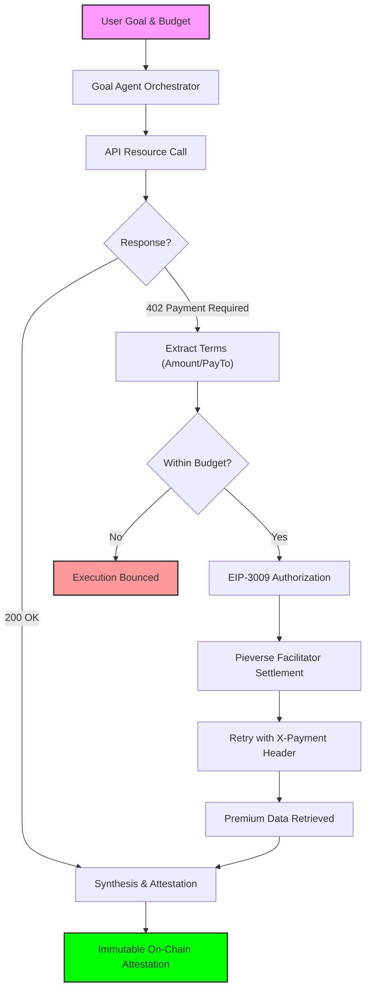

# KiteDesk — Autonomous Agentic Commerce on Kite AI

**Core Innovation:** KiteDesk deploys an AI agent that autonomously discovers services, encounters HTTP 402 paywalls, decides whether to pay within budget constraints, settles USDT micro-payments via the x402 protocol on Kite testnet (through a facilitator), and attests the complete execution trace on-chain.

## Why This Matters

Agents that can transact are fundamentally different from agents that only generate text. When an agent holds economic constraints and can choose to pay for access, it participates in real markets—not a simulated chat. The x402 cycle—**402 received → cost evaluated against budget → payment authorized → request retried with proof**—is observable agentic commerce: the same pattern HTTP 402 was designed for, now wired to programmatic settlement on-chain. KiteDesk makes that loop concrete in a live demo: budget enforcement, facilitator settlement, and a chain record of what ran and what was paid.

## Live Demo

**Production:** [http://kitedesk.agiwithai.com/](http://kitedesk.agiwithai.com/)

Product console: `/` (marketing) and `/desk` (wallet, tasks, goal agent).

## Deployment & Configuration

To ensure a successful deployment on the Kite AI Testnet, follow these configuration steps:

1.  **Wallet Provisioning:** The address associated with `ATTESTATION_SIGNER_PRIVATE_KEY` must be funded with **Testnet KITE** (for gas) and **Testnet USDT** (for x402 payments). USDT can be acquired via the [Kite portal](https://docs.gokite.ai/) or community faucets.
2.  **Environmental Variables:** Configure the following in `.env.local`:
    - `KITE_X402_TOKEN`: The USDT contract address for x402 payment lines (defaults to the Kite Testnet USDT).
    - `KITE_FACILITATOR_URL`: The Pieverse facilitator base URL (e.g., `https://facilitator.pieverse.io`).
    - `KITE_X402_DEMO_API`: (Optional) A reference URL for a Kite-hosted x402 demo resource.
3.  **Attestation Protocol:** Deploy the attestation contracts using `npm run deploy:contracts` and update `KITE_ATTESTATION_CONTRACT` in your environment settings.
4.  **Production Hardening:** Run `npm run build` to verify type safety and build stability before deploying to Vercel.

**Note:** Ensure `NEXT_PUBLIC_PLATFORM_WALLET` is set to the intended recipient address for x402 payment challenges to align with the platform's economic model.

## Core Workflow: The x402 Life Cycle

KiteDesk implements a fully autonomous commerce loop that is observable via the `/desk` console:

1.  **Objective & Budgeting:** The user defines a goal and allocates a USDT budget envelope.
2.  **402 Challenge Discovery:** The agent encounters a resource protected by an **HTTP 402 Payment Required** status, extracting the payment terms (amount and `payTo`).
3.  **Autonomous Decisioning:** The orchestrator evaluates the requested cost against the remaining budget. If authorized, it proceeds to settlement.
4.  **On-Chain Settlement:** Utilizing the **EIP-3009** protocol, the agent wallet authorizes a USDT transfer, settled by the **Pieverse facilitator** directly to the service provider on the Kite AI Testnet.
5.  **Secure Access Redemption:** The agent retries the request with a cryptographic **X-Payment** header to unlock the premium resource.
6.  **Synthesis & Attestation:** Upon completion, `attestGoal` writes an immutable record to the blockchain, including the `x402PaymentsCount` and `x402TotalPaidMicro`, providing a compact audit trail of autonomous spending.

## Tech Stack

| Layer        | Choice                                                                            |
| ------------ | --------------------------------------------------------------------------------- |
| Frontend     | Next.js 14 (App Router), TypeScript, Tailwind CSS, Framer Motion                  |
| Chain        | Kite AI Testnet (chain ID **2368**), ethers.js v6, MetaMask                       |
| User funding | Testnet USDT; gasless user transfers via Kite relayer (EIP-3009) where configured |
| x402         | HTTP 402 challenges, **X-Payment** payloads, **Pieverse facilitator** settle      |
| Agent        | Groq (`groq-sdk`), planner + tool registry, server-side orchestration             |
| Data         | Supabase (Postgres) for payment claim replay protection and history               |
| Contracts    | Solidity 0.8.20, `KiteDeskAttestations` (Hardhat)                                 |
| Deploy       | Vercel (recommended)                                                              |

Next.js app source lives under **`src/`**: **`src/app/`** (App Router pages and `api/` routes), **`src/components/`**, **`src/hooks/`**, **`src/lib/`**, and **`src/types/`**. Config, `public/`, `contracts/`, and Hardhat stay at the repo root.

## x402 Integration Details

- **Token (Kite testnet USDT):** Configure with **`KITE_X402_TOKEN`** (defaults to `0x0fF5393387ad2f9f691FD6Fd28e07E3969e27e63` if unset); confirm on [Kite testnet explorer](https://testnet.kitescan.ai).
- **Facilitator:** **`KITE_FACILITATOR_URL`** (default `https://facilitator.pieverse.io`); settle endpoint is **`/v2/settle`** appended automatically when needed.
- **Chain:** Kite AI Testnet, **chainId 2368** (RPC and explorer URLs in `.env.example`).
- **Agent wallet:** The server-side wallet backed by **`ATTESTATION_SIGNER_PRIVATE_KEY`** (contract owner / attestation signer) funds and signs x402-related USDT authorizations for per-call API payment, within the user’s verified budget envelope.

## TestSprite (MCP) testing

This repo includes a **`testsprite_tests/`** directory for **TestSprite MCP** output: backend test plans, a standardized PRD stub, Markdown + HTML reports.

| Path                                                  | Purpose                                                                                     |
| ----------------------------------------------------- | ------------------------------------------------------------------------------------------- |
| `testsprite_tests/testsprite_backend_test_plan.json`  | Generated API test case IDs and descriptions (`/api/agent`, `/api/history`, `/api/x402/*`). |
| `testsprite_tests/testsprite_frontend_test_plan.json` | Frontend plan from MCP (may be empty until PRD upload succeeds in TestSprite).              |
| `testsprite_tests/standard_prd.json`                  | Product spec JSON used to unblock backend plan generation.                                  |
| `testsprite_tests/testsprite-mcp-test-report.md`      | Human-readable audit: scope, failures, fixes, gaps, re-run steps.                           |
| `testsprite_tests/testsprite-mcp-test-report.html`    | Optional HTML export from TestSprite (excluded from Prettier in `.prettierignore`).         |

**Running tests locally:** install the TestSprite MCP in Cursor, ensure `npm run dev` is serving **port 3000**, then use MCP tools (`testsprite_generate_*`, `testsprite_generate_code_and_execute`) per TestSprite docs. Raw cloud output and secrets belong under `testsprite_tests/tmp/` — that path is **gitignored**; do not commit API keys or tunnel credentials.

**Routing note:** Next.js exposes handlers at **`/api/...`**. Some generated clients call **`/app/api/...`**; `next.config.mjs` includes a **rewrite** from `/app/api/:path*` → `/api/:path*` for compatibility.

## Local Setup

1. Clone the repository and open the project root.
2. Copy environment template: `cp .env.example .env.local` and fill all variables (Groq, Tavily/Firecrawl if using those tools, Kite RPC, USDT and attestation contract addresses, platform wallet, relayer and EIP-712 token domain as needed, **`ATTESTATION_SIGNER_PRIVATE_KEY`**, Supabase URL and service role key, **`INTERNAL_API_BASE_URL`** or app URL for the goal agent calling `/api/x402/*`).
3. Install dependencies: `npm install`.
4. Run the Supabase migration `supabase/migrations/001_kitedesk_tasks.sql` in the SQL editor for replay-safe payment claims and history.
5. Start the app: `npm run dev` and open `http://localhost:3000` (use `/desk` for the full console).
6. Optional hardening before ship: `npm run validate`. Compile and deploy attestations: `npm run compile:contracts` and `npm run deploy:contracts`, then paste the contract address into `.env.local`.

## Ship checklist (hackathon / production)

| Step                                          | Command or action                                                                                   |
| --------------------------------------------- | --------------------------------------------------------------------------------------------------- |
| Install                                       | `npm ci`                                                                                            |
| Format (CI parity)                            | `npm run format:check`                                                                              |
| Lint + build (CI parity)                      | `npm run ship`                                                                                      |
| Chain + deployed contracts                    | `npm run verify:chain` (RPC, chain **2368**, USDT + attestation bytecode)                           |
| Full gate (needs filled `.env.local` + chain) | `npm run validate`                                                                                  |
| Vercel env                                    | Set all vars from `.env.example`; **`NEXT_PUBLIC_APP_URL`** = canonical HTTPS origin                |
| Agent wallet                                  | Fund **`ATTESTATION_SIGNER_PRIVATE_KEY`** address with KITE + USDT; `npm run print:agent-wallet`    |
| Supabase                                      | Run `supabase/migrations/001_kitedesk_tasks.sql` (or task history + replay protection stay limited) |
| Demo                                          | `/` marketing, **`/desk`** wallet + goal agent + fixed-price tasks                                  |

Copy-paste checklist: [docs/CHECKLIST.md](docs/CHECKLIST.md).

Without Supabase, the app still runs: payment verification and agent execution work; the API uses an **in-memory** payment-claim and history store (fine for **local `next dev`**; on **Vercel** use Supabase so replay protection and `/api/history` stay consistent across instances). **Task history** on `/desk` still merges **browser local storage** with server entries when available.

## On-Chain Attestation

The **`KiteDeskAttestations`** contract records goal-mode runs with **`attestGoal`**. Besides the user, task id, **keccak256(final output)**, **keccak256(step trace digest)**, **total spend in micro-USDT**, **step count**, and a short **goal preview**, the attestation stores **how many tool steps completed a paid x402 path** (`x402PaymentsCount`) and **the sum of those payments in micro-USDT** (`x402TotalPaidMicro`). Together with the user’s funding transaction on-chain, that gives a compact, verifiable link between budget, autonomous API payment, and committed execution metadata.

Official Kite docs: [docs.gokite.ai](https://docs.gokite.ai/).

---

## License

MIT.
